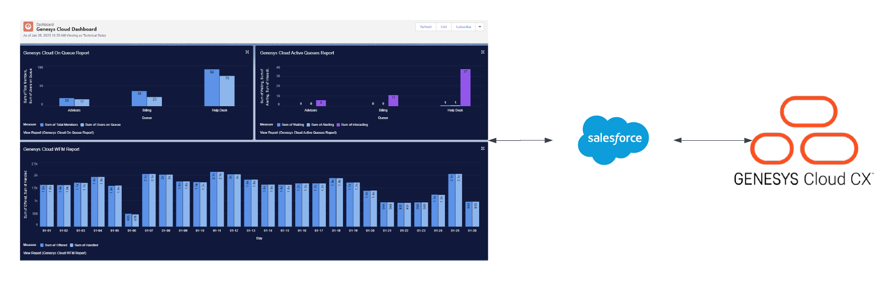

This blueprint demonstrates how to integrate Salesforce Connect with the Genesys Cloud Analytic API's. Once Salesforce Connect is quering Analytics data from Genesys Cloud, dashboards can be built directly inside Salesforce to visualize the data. 



## Scenario

An organization is using the "Genesys Cloud for Salesforce" integration and would like to enable Supervisors to view reporting and analytics directly from Salesforce. This solution will provide:

* An single interface (Salesforce) for Supervisors and they will not have to use the Genesys Cloud UI to view Analytics and Dashboards

* Realtime queries against Genesys Cloud API's

* Easy to read dashboard and visualizations representing the Genesys Cloud Analytics datasets

## Solution

This blueprint explains how to use the following Genesys Cloud capabilities: 

1. **Analytic API's** - rich set of data for customer/agent interactions and agent perforamnce

Additionally, this blueprint explains how to deploy the Salesforce components:
* Salesforce Connect
* Salesforce Apex Classes
* Dashboards 

## Solution components

* **Genesys Cloud CX** - A suite of Genesys Cloud services for enterprise-grade communications, collaboration, and contact center management. In this solution, you use an Architect bot, Architect message flow, a Genesys Cloud integration, data action, queues, and a web messaging widget.
* **Salesforce Connect** - Provides a seamless integration of data stored outside of Salesforce.
* **Salesforce Apex Classes** - An object-oriented programming language that allow developers to execute flow and transaction control statements on Salesforce and its related API's. 

## Software development kits

No Genesys Cloud SDKs are needed for this blueprint solution.

## Prerequisites

### Specialized knowledge

* Administrator-level knowledge of Genesys Cloud
* Salesforce Apex knowledge

### Genesys Cloud account

* A Genesys Cloud license. For more information see, [Genesys Cloud Pricing](https://www.genesys.com/pricing "Opens the Genesys Cloud pricing page") in the Genesys website. 
* Analytics API role. For more information see, [Roles and permissions overview](https://help.mypurecloud.com/?p=24360 "Goes to the Roles and permissions overview article") in the Genesys Cloud Resource Center.

### Salesforce account
* **Salesforce Connect Licenses**

## Implementation steps

### Clone the GitHub repository

Clone the [salesforce-dashboards-with-gc-analytics-blueprint](https://github.com/GenesysCloudBlueprints/salesforce-dashboards-with-gc-analytics-blueprint) GitHub repository on your local machine. The `salesforce-dashboards-with-gc-analytics-blueprint/blueprint` folder includes solution-specific scripts and files in these subfolders:

* `apex-classes` - All Salesforce Apex Classes that are needed to deploy the solution.

## Create Apex Classes
You will need to import two Apex class files for each desired Genesys Cloud Analytics API query. 
* Apex DataSource.Connection - contains the Genesys Cloud Analytics API query as well as the logic to process the response
* Apex DataSource.Provider - Allows the Datasource.Connection Apex class to be used used as an Salesforce External Data Source

### Data Source Connection
**This Apex class contains the Genesys Cloud Analytics API query as well as the logic to process the response.**

Three example Apex classes are included in this [repo](https://github.com/GenesysCloudBlueprints/salesforce-dashboards-with-gc-analytics-blueprint/tree/main/blueprint/apex-classes) that will setup 3 individual data source connections:
* gcQueueDataSourceConnection.cls - Queue Observation Analytics API query
* gcSurveyDataSourceConnection.cls - Survey Aggregates Analytics API query
* gcWFMDataSourceConnection.cls - Conversations Aggregates Analytics API query

It is recommended you open the individual Apex Classes in a text editor to review and make any necessary adjustsments.
Below includes a example Apex Class calling DataSoure.Connection:

> You must specify a unique class name for each DataSource.Connection declaration (this repo contains 3 declarations within 3 individual Apex Class files). In the below code snippet, the name class name of "gcQueueDataSourceConnection" was chosen, but this can by name that is desired, as long as its unique in your Salesforce instance. 

```
global class gcQueueDataSourceConnection 
	extends DataSource.Connection {
        private DataSource.ConnectionParams connectionInfo;
    global gcQueueDataSourceConnection(DataSource.ConnectionParams connectionParams) {
        this.connectionInfo = connectionParams;
    }
    
    /**
    *   Example vales to be passed to salesforce in order to build reports
    **/

    override global List<DataSource.Table> sync() {
        List<DataSource.Table> tables = new List<DataSource.Table>();
        List<DataSource.Column> columns;
        columns = new List<DataSource.Column>();
        columns.add(DataSource.Column.text('ExternalId', 36));
        columns.add(DataSource.Column.text('surveyFormName', 50));
        columns.add(DataSource.Column.text('mediaType', 25));
        columns.add(DataSource.Column.integer('count', 3));
        columns.add(DataSource.Column.integer('sum', 3));
        return tables;
    }
        
    override global DataSource.TableResult query(DataSource.QueryContext context) {
        String url = '/api/v2/analytics/surveys/aggregates/query';
        
        List<Map<String, Object>> rows = getData(url);
        return DataSource.TableResult.get(true, null, context.tableSelection.tableSelected, rows);
    }
        
    public List<Map<String, Object>> getData(String url) {
        JSONParser data = JSON.createParser(getResponse(url));
        return getData(data);
    }
     
    private String getResponse(String url) {
    	HttpResponse response = purecloud.SDK.Rest.post(url, postBody());
        return response.getBody();
    }
    /**
    *   this is an example of processing the response from Genesys Cloud. You will need to search the response  
    *   and create rows from the associated data contained within
    **/

    private List<Map<String, Object>> getData (JSONparser json){
        List<Map<String, Object>> data = new List<Map<String, Object>>();
        Map<String, Object> element = new Map<String, Object>();
        
        integer keysFilled = 0;
        integer externalId = 0;
        string userId = 'none';
        
        while (json.nextToken() != null) {
            String text = json.getText();
            switch on text {
                when 'userId' {
                    json.nextToken();
                    userId = json.getText();
                    element.put('ExternalId', userId + String.valueOf(externalId));
                    externalId++;
                    keysFilled++;
                }                        
                when 'nSurveyNpsPromoters' {
                    json.nextToken();
                    json.nextToken();
                    json.nextToken();
                    json.nextToken();
                    element.put('Promoters', json.getIntegerValue());
                    keysFilled++;
                }
                when 'count', 'sum' {
                    json.nextToken();
                    element.put(text, json.getIntegerValue());
                    keysFilled++;
                }
                when 'mediaType', 'surveyFormName' {
                    json.nextToken();
                    element.put(text, json.getText());
                    keysFilled++;
                }
                when 'group' {
                    if (keysFilled > 0) {
                        element.put('Agent', userId);
                        data.add(element);
                        element = new Map<String, Object>();
                        keysFilled=0;
                    }
                }
            }
        }
        element.put('Agent', userId);
        data.add(element);
        return data;
    }
    
    /**
    *   this is an example of the request JSON construction. The logic is simple enough to follow. I recommend 
    *   you use a code editor and follow along as you create this
    **/
    
    private String postBody() {
	JSONGenerator gen = JSON.createGenerator(true);
        gen.writeStartObject();
        gen.writeStringField('interval', getInterval());
        gen.writeFieldName('filter');
        gen.writeStartObject();
        gen.writeStringField('type', 'AND');
	gen.writeFieldName('predicates');
	gen.writeStartArray();
        gen.writeStartObject();
        gen.writeStringField('dimension', 'surveyFormName');
        gen.writeStringField('operator', 'matches');
        gen.writeEndObject();
        gen.writeStartObject();
        gen.writeStringField('dimension', 'userId');
        gen.writeStringField('operator', 'exists');
        gen.writeEndObject();
        gen.writeEndArray();
        gen.writeEndObject();
        gen.writeFieldName('groupBy');
        gen.writeStartArray();
        gen.writeString('surveyFormName');
        gen.writeString('userId');
        gen.writeEndArray();
	gen.writeFieldName('metrics');
        gen.writeStartArray();
        gen.writeString('nSurveyNpsPromoters');
        gen.writeString('oSurveyQuestionScore');
        gen.writeEndArray();
	gen.writeBooleanField('flattenMultivaluedDimensions', true);
        gen.writeEndObject();
        
        return gen.getAsString();
    }
        
        private string getInterval() {
            Date now = Date.today();
            string month = string.valueOf(now.month());
            if (month.length()<2) {
                month = '0' + month;
            }
            string year = string.valueOf(now.year());
            string endOfMonth = string.valueOf(date.daysInMonth(now.year(), now.month()));
            return year + '-' + month + '-01T00:00:00/' + year + '-' + month + '-' + endOfMonth + 'T00:00:00';
        }
}
```

### Data Source Provider
**This code will extend the DataSource.Connection classes to be created as External Data Sources within Salesforce.**

> You must specify a unique class name for each DataSource.Provider declaration (this repo contains 3 declarations within 3 individual Apex Class files). In the below code snippet, the name class name of "gcQueueDataSourceProvider" was chosen, but this can by name that is desired, as long as its unique in your Salesforce instance. 

	
```
/**
 *   Extends the DataSource.Provider base class to create a 
 *   custom adapter for Salesforce Connect. The class informs 
 *   Salesforce of the functional and authentication 
 *   capabilities that are supported by or required to connect 
 *   to an external system.
 **/
global class gcQueueDataSourceProvider
    extends DataSource.Provider {
 
    /**
     *   Declares the types of authentication that can be used 
     *   to access the external system.
     **/
    override global List<DataSource.AuthenticationCapability>
        getAuthenticationCapabilities() {
        List<DataSource.AuthenticationCapability> capabilities =
            new List<DataSource.AuthenticationCapability>();
        capabilities.add(
            DataSource.AuthenticationCapability.ANONYMOUS);
        return capabilities;
    }
 
    /**
     *   Declares the functional capabilities that the 
     *   external system supports.
     **/
    override global List<DataSource.Capability>
        getCapabilities() {
        List<DataSource.Capability> capabilities =
            new List<DataSource.Capability>();
        capabilities.add(DataSource.Capability.ROW_QUERY);
        return capabilities;
    }
 
    /**
     *   Declares the associated DataSource.Connection class.
     **/
    override global DataSource.Connection getConnection(
        DataSource.ConnectionParams connectionParams) {
        return new gcQueueDataSourceConnection(connectionParams);
    }
}
```
## Importing Apex classes into Salesforce
In order to use the Apex classes, they will need to be imported into Salesforce. Minimally 2 Apex classes will need to be imported (One for DataSource.Connection and one for DataSource.Provider) for each Genesys Cloud Analytics Query. There are 3 Genesys Analytic Query examples in this Blueprint for a total 6 required Apex Classes that need to be imported. 

1. Open **Setup**.


2. Search for **apex** in the Quick Find and select **Apex Classes** then **New**.


3. Paste in the code for DataSource.Connection clas first, save the Apex class, then repeat for the DataSource.Provider Apex class.

> YOU MUST ADD THE DATASOURCE.CONNECTION APEX CLASS FIRST.
> The code will be checked for syntax errors. If any syntax errors are triggered, they will be to be resolved before the Apex Class can successfully be saved. 


## Creating Salesforce External Data Source and related External Object
### Salesforce External Data Source
Now that the required Apex classes are imported, an External Data Source will need to be created that runs the Apex Classes and retrieves the related data from the Genesys Cloud Analytics API query. This Blueprint will require that 3 External Data Sources are created. 

1. Open **Setup**.

2. Search for **external** In the Quick Find

3. Select **External Data Sources**. 


4. Select **New External Data Source** 


5. Fill in the required information about the External Data Source:
    - Type: Select the name of the recently imported Apex DataSource.Provider classes
    - Identity Type: Leave at default value
    - Authentication Protocol: Leave at default value


6. Repeat these steps 2 more times for the other two DataSource.Provider Apex Classes

###  Salesforce External Data Objects
After the 3 External Data Source's are created, Salesforce External Data Objects are created and referenced to the newly created External Data Source's. 

1. Search for **external** In the Quick Find

2. Select **External Objects**

3. Select **New External Object**


4. Fill in the required information about the External Object. 
    - Object Name - unqiue name of the External Object
    - External Connection Detail
        - External Data Source - Search for the External Data Source
    - Optional Features
        - Allow Reports: **YOU MUST ENABLE REPORTS FOR THIS TO SHOW**


5. When you are done select "Save" and then proceed to open the newly created External Object. 

6. Define a custom field for each returned field from the DataSource.Connection class. This should be 1 for 1 and match each field declared in List<DataSource.Table>

```
    override global List<DataSource.Table> sync() {
        List<DataSource.Table> tables = new List<DataSource.Table>();
        List<DataSource.Column> columns;
        columns = new List<DataSource.Column>();
        columns.add(DataSource.Column.text('ExternalId', 36));
        columns.add(DataSource.Column.text('surveyFormName', 50));
        columns.add(DataSource.Column.text('mediaType', 25));
        columns.add(DataSource.Column.integer('count', 3));
        columns.add(DataSource.Column.integer('sum', 3));
        return tables;
    }
```


7. Repeat these steps 2 more times for the other two External Data Sources

## Creating Salesforce Reports
After the External Data Sources and Objects are created, Reports can be created to call the External Data Sources and query the Genesys Cloud Analytics API and pull in the returned data. 

1. From your Salesforce App, navigate to **Reports** and start a **New Report** which will launch the **Report Builder**. If Reports are not available in your Salesforce App, this will need to be added. 


2. From here, select **Other Reports** and find the Salesforce External Object's you named earlier (there will be 3 entries for this Blueprint). Then **Start Report**.


This Blueprint will create 3 reports that links to the External Data Sources. After clicking **Other Reports** and finding the Salesforce External Object's, select **Run** as this will kick off the Apex class and return data from the Genesys Cloud Analytics API. Once a query has been performed, the report builder will render the fields and results that then can be modified and manipulated:

### Queue Observations
1. Set Group Rows to *Queue* and *Media Type*. Then set *Total Members* and *Users on Queue* to your Columns Selection.
2. Create a chart and set the values to match the image below. Making sure to check **Show Values** and set the legend to the bottom.
3. Verify the chart looks relevant and save it with an appropriate name.


1. Set Group Rows to *Queue*. Then set *Waiting*, *Alerting*, and *Interacting* to your Columns Selection.
2. Create a chart and set the values to match the image below. Making sure to check **Show Values** and set the legend to the bottom.
3. Verify the chart looks relevant and save it with an appropriate name.

### Conversations
1. Set the Group Rows to *Day*. Add *Handled* and *Offered* to the Columns selection.
2. Create a chart and add the values from the image below.
3. Verify the data and save with an appropriate name.


### Survey Observations
1. Set *Media Type* as your Group Rows and *Surveys Sent* and *Survey Responses* 
2. Create a chart and follow the settings in the image below. Making sure to check **Show Values** and set the legend to the bottom.
3. Verify the chart makes sense. 
4. Verify the chart looks relevant and save it with an appropriate name.


1. You will need to set the Group Rows to *Media Type* first.
2. Open the fields menu from the left side of the page and select *Create Formula*.
3. Set the *Total* to be divided by *Count*
4. Add this function along with the minumum and maximum values.
5. Create a chart to reflect the values from the image below. Making sure to check **Show Values** and set the legend to the bottom.
6. Verify the chart looks relevant and save it with an appropriate name.


## Creating a dashboard

1. From your Salesforce App, navigate to **Dashboards** and start a **New Dashboard** which will launch the Dashboard build UI. 


2. Select the **New Dashboard** button, which will launch the Dashboard build UI. 


3. Provide an appropriate name and select *Create*


4. Select **Add component**. Add each report (a total of 3 reports in this Blueprint) one at a time


5. Make sure to select **Use chart settings from report**. Otherwise it will not look the way you set up.


6. Once the report is saved, it will look similar to the following:


## Additional resources

* [Genesys Cloud Analytics API](https://developer.genesys.cloud/analyticsdatamanagement/analytics/)
* [Salesforce Apex](https://developer.salesforce.com/docs/atlas.en-us.apexcode.meta/apexcode/apex_intro_what_is_apex.htm) 
* [Salesforce Connect](https://help.salesforce.com/s/articleView?id=sf.platform_connect_about.htm&type=5)